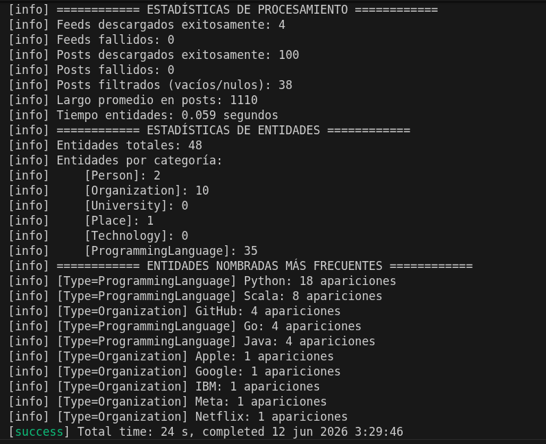
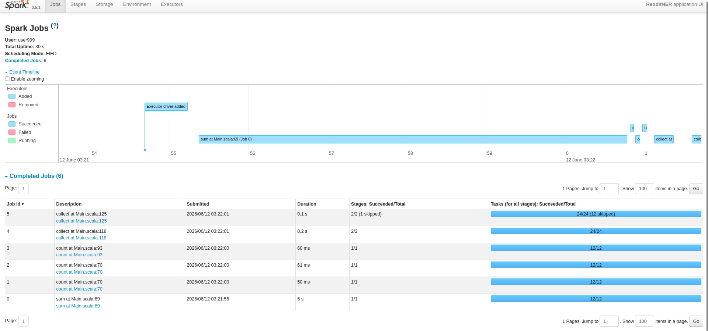

# Grupo 46 - Integrantes
 - Bosque, Lissandro
 - Galassi, Franco
 - Pairetti, Joaquín

## Ejercicio 1
a)

b)

| Paso | Abstracción Spark |
|------|------------------|
| Lectura de subscriptions | Ninguna (driver) | 
| Conexión y descarga del feed | `flatMap` |
| Filtrar posts | `filter` |
| Cargar diccionario | Ninguna (driver) |
| Extraer entidades nombradas | `flatMap` |
| Clasificar entidades | `map` |
| Contar entidades | `reduceByKey` |
| Imprimir estadísticas | Ninguna (driver) |

**Lectura de subscriptions**

No encaja en ninguna abstracción de Spark porque ocurre antes de que exista un RDD. Es una operación de inicialización que el driver necesita hacer primero para saber qué URLs paralelizar. No hay elementos sobre los cuales mapear todavía.

**Cargar diccionario**
Tampoco encaja porque es un input auxiliar que todos los workers necesitan compartir, no algo que se procesa en paralelo. 

**Imprimir estadísticas** 

Imprimir es un efecto secundario, no una transformación de datos. Spark requiere que las funciones que se pasan a map, flatMap etc. sean puras (sin efectos secundarios) para poder distribuirlas y reejecutarlas si fallan. Además necesita todos los datos ya reducidos y ordenados antes de imprimir, lo cual solo el driver puede hacer.

c)
En el esqueleto incial no existe ninguna barrera porque no hay paralelismo, al momento de paralelizar con Spark, si las hay.

Barreras en pipeline
---

**Contar entidades**
(usando `reduceByKey`) es la única barrera real. Para saber cuántas veces apareció "Python" en total, hay que esperar que todos los workers terminen de extraer entidades de todos sus posts. Ningún worker puede producir el conteo final hasta que todos hayan terminado.

**Imprimir** las estadísticas también podría llegar a ser una barrera, porque el driver no puede imprimir el ranking hasta tener todos los conteos.

Independientes en pipeline
---
**Descarga y parseo** cada worker descarga su URL sin saber nada de los otros.

**Filtrado de posts** cada worker filtra sus propios posts de forma independiente.

**Extracción de entidades** cada worker procesa sus propios posts sin coordinarse.

**Clasificación (map a pares ((tipo, nombre), 1))** cada entidad se transforma de forma completamente independiente.

d)

Las funciones que se pasan a las transformaciones de Spark deben cumplir tres restricciones para poder ejecutarse en un entorno distribuido.

**Serialización:** Cuando Spark distribuye una transformación, serializa la función y todo el contexto que esta captura para enviarlo por la red a cada worker. Por esta razón, todos los objetos que la función referencie deben implementar la interfaz `Serializable`. Si algún objeto capturado no es serializable, Spark lanza una excepción antes de ejecutar cualquier tarea.
Por ejemplo, las entidades en `Dictionary` deberán ser serializadas para su correcto funcionamiento.

**Estado compartido:** Las funciones no pueden leer ni escribir estado compartido mutable. En un cluster distribuido, cada worker ejecuta en una máquina con su propia memoria independiente, no existe memoria compartida entre workers ni entre workers y el driver. Si una función modifica una variable del driver desde dentro de una transformación, cada worker opera sobre su propia copia local y los cambios nunca se propagan. El único mecanismo provisto por Spark para que los workers comuniquen información al driver de forma segura son los Accumulators, que solo permiten operaciones de incremento.

**Efectos secundarios:** Las funciones deben ser puras o carecer de efectos secundarios observables. Spark puede reejecutar una tarea si esta falla, lo que implica que una misma función puede invocarse múltiples veces sobre el mismo elemento. Si la función tiene efectos secundarios, estas rejecuciones pueden producir resultados incorrectos o duplicados. En modo local los `println` dentro de transformaciones son visibles porque driver y workers comparten el mismo proceso, pero en un cluster real los logs de los workers solo son accesibles a través de la Spark UI.
## Ejercicio 2
**¿qué pasaría si dejaran propagar la excepción?**

Spark reintentaría la tarea múltiples veces hasta llegar a su límite (por defecto 4 intentos) y a partir de ahí la consideraría fallida y abortaría todo el proceso.

## Ejercicio 3

**`reduceByKey` es una barrera de sincronización. ¿Qué ocurre en el cluster en ese punto? ¿Por qué es inevitable para este problema?**

Cuando Spark ejecuta un `reduceByKey` todos los workers reorganizan sus datos de forma que todos los pares con la misma clave queden en el mismo worker. Una vez redistribuidos, cada worker aplica la función de reducción sobre los pares que le tocaron. Ningún worker puede producir su resultado parcial hasta haber recibido todos los datos que le corresponden, y el driver no puede continuar hasta que todos los workers terminen. 
Es inevitable para este problema porque para saber cuántas veces apareció "Python" en total es imposible saberlo sin combinar los conteos parciales de todos los workers. No existe forma de calcular este resultado de manera completamente independiente por cada worker.

**¿Qué restricciones debe cumplir la función que se le pasa a `reduceByKey`?**

La función debe ser **asociativa** y **conmutativa**. Spark realiza reducciones parciales en cada worker antes de enviar datos por la red, para minimizar la transferencia. Esto significa que los valores se combinan en orden y agrupaciones no determinísticas dependiendo de cómo se distribuya la carga. 

**¿Dónde se hace la lectura del diccionario?**

La lectura del diccionario se hace en el **driver**, antes de cualquier transformación distribuida. El diccionario se carga con `Dictionary.loadAll(cmdArgs.entitiesDir)` y el resultado es una `List[NamedEntity]` que luego se captura en el closure del `flatMap`. Spark serializa esa lista y la envía a cada worker junto con la función. 

## Ejercicio 4

**¿Por qué los Accumulators solo deben usarse para métricas y no para tomar decisiones lógicas?**

Los Accumulators son variables que los workers solo pueden incrementar y el driver solo puede leer. Estos pueden dar un valor incorrecto cuando Spark reintenta una tarea fallida. Si una tarea falla y se reintenta, el accumulator se incrementa dos veces por el mismo trabajo, una por la tarea fallida y otra por el reintento exitoso. Spark no deshace los incrementos de tareas fallidas, por lo que el valor final puede ser mayor al real causando conclusiones incorrectas si se basan puramente en ellos.

**¿En qué momento está disponible el valor de un Accumulator para el driver?**

El valor de un Accumulator solo es confiable después de que se completa una acción terminal (como `count()`, `collect()`, o `reduce()`). Antes de eso, el pipeline es lazy y los workers no han ejecutado nada, por lo que el accumulator vale 0 aunque el código que lo incrementa ya esté definido. En nuestro caso, los accumulators tienen sus valores correctos recién después del primer `count()` que dispara el pipeline de descarga.

---

**Comparación de tiempos entre versión secuencial y versión con Spark**

Para la cantidad de datos que estamos trabajando , la versión con Spark no muestra una mejora apreciable respecto a la versión secuencial, en este caso incluso es más lenta. Esto se debe a que Spark tiene un overhead de inicialización significativo: crear la SparkSession, el SparkContext, serializar los datos y distribuir las tareas entre workers toma tiempo fijo independientemente del volumen de datos.
Con datasets pequeños, ese overhead domina el tiempo total y supera el beneficio de la paralelización. La ventaja de Spark se vuelve apreciable cuando el volumen de datos es grande. Por ejemplo, cientos de feeds con miles de posts cada uno, donde el tiempo de procesamiento paralelo supera ampliamente el costo de inicialización. Para el caso de uso de este laboratorio, la diferencia no es significativa, pero el código está preparado para escalar sin modificaciones.

**Resultados del skeleton base**

**SparkUi**

| Etapa | Secuencial | Spark |
|-------|-----------|-------|
| Cómputo de entidades | 0.059 s | ~0.3 s (Jobs 4+5) |
| Total sbt run | 24 s | ~30 s |

**Conclusión**: Para este dataset pequeño, la versión con Spark es más lenta en total debido al overhead de inicialización. El cómputo de entidades es incluso más rápido en la versión secuencial porque no tiene el costo de serialización y distribución de tareas. Sin embargo, la descarga de feeds sería donde Spark mostraría ventaja con más datos, al paralelizar las requests HTTP.

## Ejercicio 5

**¿Qué ocurriría si no llamaran a cache()? ¿Cuántas veces se ejecutaría la descarga de feeds?**

Sin `.cache()`, cada acción sobre un RDD recomputa todo el pipeline desde el principio, incluyendo las descargas HTTP. En nuestro código, `downloadResults` y `filteredPosts` son utilizados por múltiples acciones (`count()`, `sum()`, `flatMap()`, `collect()`). Sin cache, cada una de esas acciones volvería a descargar los 4 feeds desde el servidor, ejecutando la descarga aproximadamente 6-7 veces en total. Volviéndose muy ineficiente y lento.

**¿Por qué es incorrecto llamar a collect() entre los pasos a) y b) del ejercicio 3 y luego continuar el pipeline? ¿Qué consecuencia tiene sobre la distribución del trabajo?**

Si se llama a `collect()` entre el `flatMap` y el `map`, se trae toda la data al driver y las operaciones siguientes (`map`, `reduceByKey`) se ejecutan localmente en el driver en vez de distribuirse entre los workers. Esto rompe el modelo distribuido de Spark: el trabajo deja de paralelizarse y pasa a ejecutarse secuencialmente en un único proceso. Además, si el dataset es grande, el driver podría quedarse sin memoria al intentar cargar todos los datos.

---

**cache() es también lazy. ¿En qué momento se almacena realmente el RDD en memoria?**

Llamar a `.cache()` solo marca el RDD para ser persistido, pero no lo materializa inmediatamente. El RDD se almacena en memoria la primera vez que se ejecuta una acción sobre él (`count()`, `collect()`, `sum()`, etc.). En ese momento Spark computa el RDD, lo guarda en memoria, y las acciones siguientes lo leen directamente sin recomputar el pipeline desde el principio.